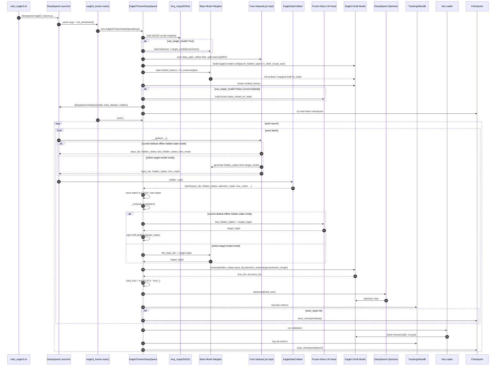
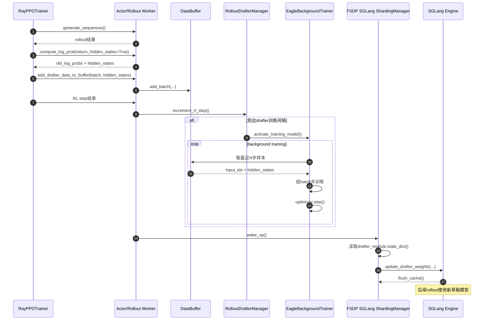
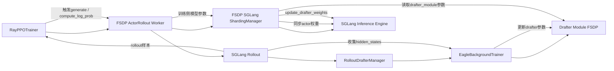
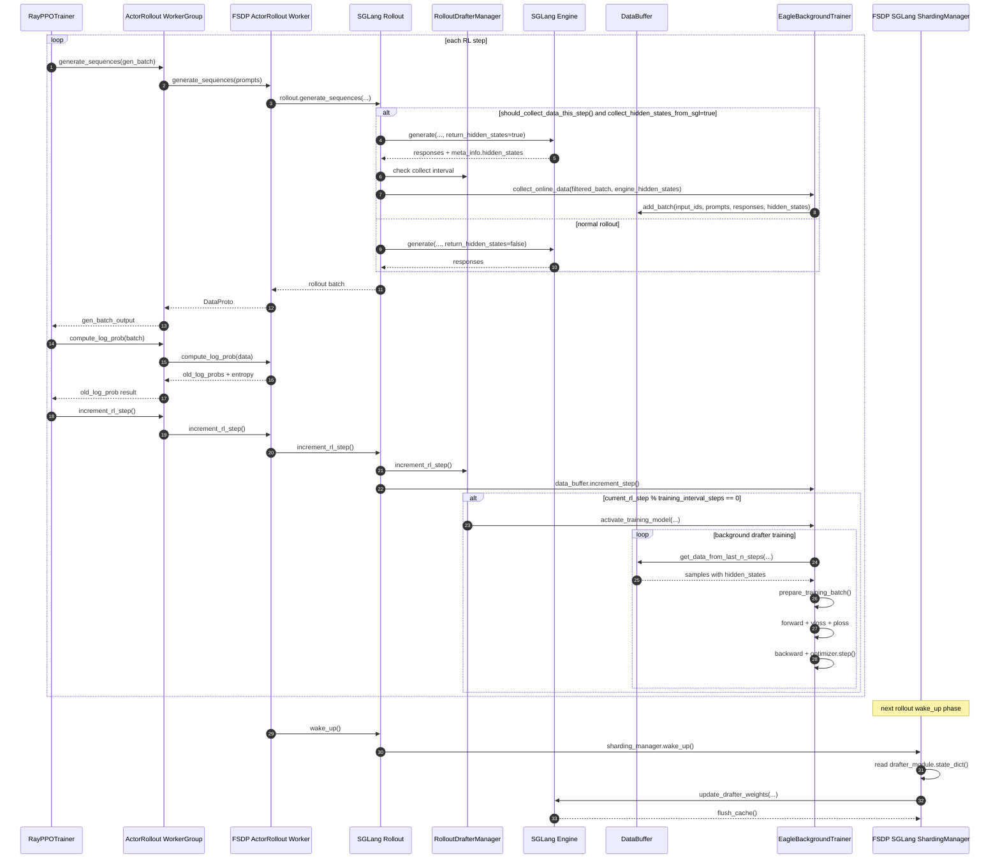
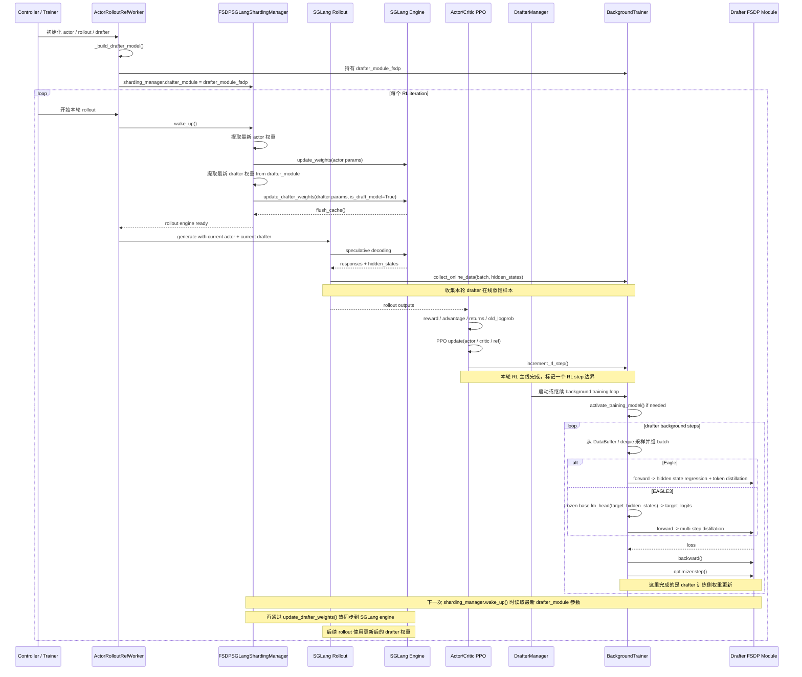

主线

初始化 actor、rollout、drafter、background trainer
rollout 用当前 actor + drafter 做生成
SGLang engine 返回 responses 和 hidden states
hidden states 被送进 BackgroundTrainer.collect_online_data()
RL 主线拿 rollout 结果做 reward/advantage/PPO update
drafter 支线异步启动 training loop
trainer 从 DataBuffer/deque 组 batch
Eagle 或 EAGLE3 做在线蒸馏更新
定期保存 checkpoint，结束时 cleanup/offload
更新后的 drafter 继续服务下一轮 rollout

RL 主线：rollout -> reward/advantage -> PPO 更新 actor/critic
drafter 支线：rollout hidden_states -> collect_online_data -> 后台蒸馏训练 drafter